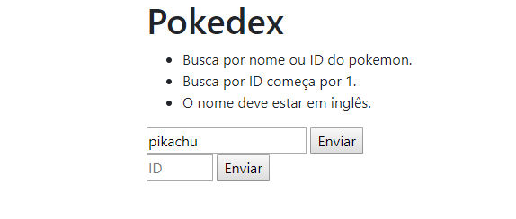
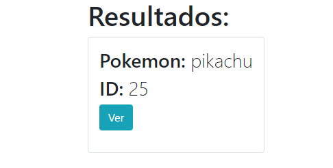
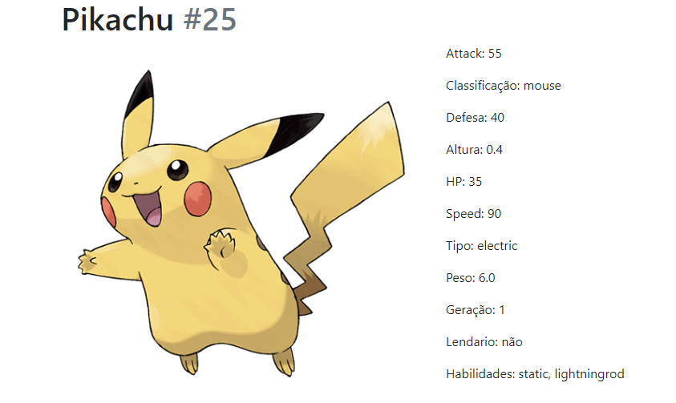

#teste-aeogi#
Teste pra vaga de estagio
#Tela de busca

#Tela de resultados

#Pokemon

##Instruções para o teste
Foi usado Python 3.7 , Mysql 8.0 , Django 2.2.
1. Instalar o python no pc (https://www.python.org/downloads/)
2. Instalar o django usando o comando 'pip install django' no cmd do windows'.
1. Rodar o script "criar_tabela_pokedex.sql" para criar o banco de dados e a tabela.
2. 
